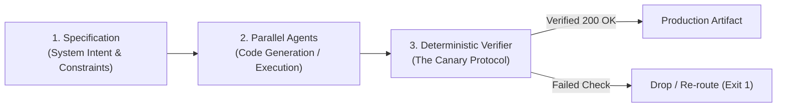

# The Transition to Agentic Engineering: Developers as System Orchestrators

> *"You do not write software packet by packet; you design the factory that manufactures and verifies the software."*

---

## 1. The Death of the Craft Model

For forty years, software development operated under the **Craft Model**. The individual developer sat in front of an editor, held the entire system state in working memory, and manually typed out line-by-line syntax. Productivity was bound to typing speed, context-switching tolerance, and cognitive fatigue.

In the agent-first era, syntax generation is virtually free. The bottleneck has inverted:

* **Old Bottleneck:** Emitting code (Writing syntax).
* **New Bottleneck:** Attention routing and deterministic verification (Directing agents and proving output).

The developer is no longer a code-typist. The developer is a **System Orchestrator** running a digital factory.

---

## 2. The Factory Model: Orchestration & Verification

In an agentic workflow, work is broken into three asynchronous layers:

1. **Specification (Intent Architecture):** The human operator defines the constraints, boundaries, and expected system state using declarative prompts, skill definitions (`SKILL.md`), and protocols.
2. **Parallel Agent Execution (The Factory Floor):** Autonomous subagents execute specialized workloads concurrently—one audits security, another refactors dependencies, a third drafts documentation.
3. **The Deterministic Gate (Verify-Before-Logging):** Agents hallucinate; compilers and network protocols do not. An agent's output is untrusted until a deterministic check (unit tests, integration suites, or a Canary deploy script) proves the state is valid.

---

## 3. Cognitive Sovereign Infrastructure

When you orchestrate agents, you must protect your own origin core. If you spend your day fielding unvetted pings, reading raw logs, and jumping between tabs, you expose your cognitive port 22 to the public internet.

Agentic engineering requires **Sovereign Infrastructure**:
* Route workhorse tasks to fast models (local Ollama instances or targeted subagents).
* Enforce hard edge-drop firewalls on low-value interruptions.
* Save your finite bandwidth for high-leverage architectural decisions.

---

## 4. Further Reading & Foundational Texts

To dive deeper into the technical architecture of autonomous agent systems:

* [**Google & Kaggle: Agentic Systems Whitepaper**](https://www.kaggle.com/whitepaper-agents) — The canonical architectural framework for agent memory, tools, and multi-agent coordination.
* [**Model Context Protocol (MCP)**](https://modelcontextprotocol.io) — The open standard connecting LLMs to external tools and enterprise datasets.
* [**Sovereign Infrastructure & Attention Routing Codelab**](./module-1-awareness.md) — Hands-on implementation of Sentinel nodes, Canary deployments, and Edge Drop firewalls.
