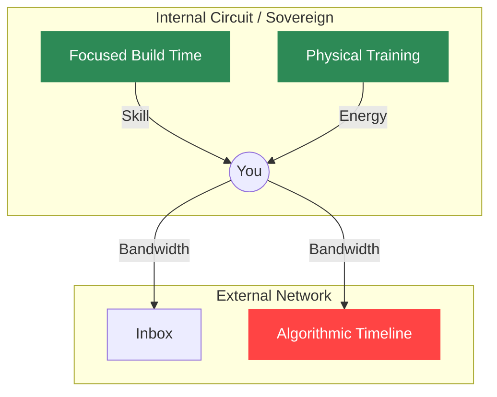

# Module 1: The Physics of the Stack (Awareness)

You do not have a time problem. You have a routing problem.

Most productivity advice treats human attention like a schedule to be managed. We are going to treat it like a network to be architected. 

If you run a server, you know exactly what is draining its CPU, where the network bottlenecks are, and which ports are exposed to the public internet. But if you look at your own daily attention, you are likely running completely blind. You are allowing third-party algorithms, notifications, and low-value demands to pull from your internal capacity without restriction.

In this module, we apply **Attention Architecture**—the practice of applying systems design directly to human behavior. 

## 1.1 The Baseline: Defining Bandwidth

In a technical system, **Bandwidth** is the maximum rate of data transfer across a given path. If you exceed it, packets drop and the system crashes. 

In this architecture, your cognitive capacity is your network Bandwidth. It is finite, measurable, and highly vulnerable to DDoS attacks (in the form of infinite scrolling, rent-seeking platforms, and context switching). 

To regain control of your Bandwidth, you must stop treating your attention as an infinite resource and start treating it as a closed-loop electrical circuit. 

## 1.2 Topology Mapping

To secure a network, you must first map its topology. Every endpoint in your life (both technical tools and psychological habits) falls into one of two categories:

- **Sources:** Nodes that supply power. These generate compounding value. (e.g., Deep work sessions, writing code, exercise, reading a book).
- **Loads:** Nodes that draw power. These consume your Bandwidth. (e.g., Checking email, debugging a broken pipeline, commuting).

A healthy system requires Loads. You have to spend energy to live. The danger lies in a specific type of Load: the **Dead Port**.

A Dead Port is an endpoint that draws a current but returns zero compounding value. 
- *Technical Dead Port:* A redundant API polling a database that hasn't updated in weeks.
- *Psychological Dead Port:* Scrolling a social media feed algorithm designed to keep you engaged without providing actionable signal.

Your first job as an Operator is to identify every Dead Port on your network.

---

## Lab 1: The Topology Audit

You cannot route traffic if you don't have a map. In this lab, you will write a declarative map of your current network using Mermaid.js syntax.

**The Deliverable:**
Write a Mermaid flowchart that explicitly classifies your daily tools and habits as Sources, Loads, or Dead Ports. 

**Instructions:**
1. Create `topology-audit.md` in the root of your project directory (or use the code block below as a starting point).
2. Group your nodes into two subgraphs: `Internal Circuit` (what you control) and `The Road` (external platforms you lease time on).
3. Draw directional arrows (`-->`) showing where your Bandwidth flows.

**Example Baseline Map:**

**Checkpoint:** If your map has zero Dead Ports, you haven't been honest yet.

Once you have mapped your topology and identified the Dead Ports, you are ready for Module 2. We are going to build the infrastructure required to actively drop that dead traffic at the network edge.
