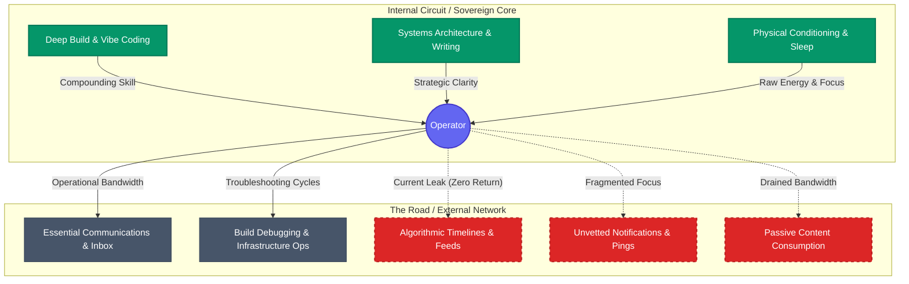

# Attention Architecture: Topology Audit

> **Core Axiom:** You do not have a time problem. You have a routing problem.
> 
> *Treat cognitive capacity as a closed-loop electrical circuit with finite bandwidth. Identify all Sources, balance necessary Loads, and locate every Dead Port draining current with zero compounding return.*

---

## 1. Network Topology Map

---

## 2. Endpoint Inventory & Capacity Ledger

| Endpoint Node | Network Zone | Node Type | Estimated Bandwidth Draw | Compounding Return / Yield |
| :--- | :--- | :--- | :--- | :--- |
| **Deep Build & Vibe Coding** | Internal Circuit | **Source** | High Output | **High** — Produces working software & leverage |
| **Systems Architecture & Writing** | Internal Circuit | **Source** | High Output | **High** — Produces intellectual capital & clarity |
| **Physical Conditioning & Recovery** | Internal Circuit | **Source** | 1–2 hrs / day | **High** — Recharges baseline hardware (body & mind) |
| **Essential Comms (Email / Discord)** | The Road | **Load** | ~1 hr / day | **Neutral** — Necessary for operational alignment |
| **Build Ops & Pipeline Maintenance** | The Road | **Load** | Variable | **Neutral** — Keeps infrastructure online |
| **Algorithmic Feeds & Timelines** | The Road | **Dead Port** | Leaking Bandwidth | **Negative** — Dopamine loop with zero retained value |
| **Reactive Push Notifications** | The Road | **Dead Port** | Context switching | **Negative** — Constant interrupt vector on CPU |
| **Passive Rabbit Holes** | The Road | **Dead Port** | Low-energy drift | **Negative** — Simulates work without output |

---

## 3. Firewall Candidates (Candidates for Module 2 & 3 Edge Drops)

Identify the specific endpoints to terminate or route through automated filters:

1. **Dead Port #1 to Sever:** 
   * *Endpoint:* Algorithmic social media during deep work windows.
   * *Edge Action:* Hard firewall rule (DNS block / screen lockout).
2. **Dead Port #2 to Filter:**
   * *Endpoint:* Reactive incoming notifications and pings.
   * *Edge Action:* Asynchronous batching — route through Canary verification or silence push channels.
3. **Dead Port #3 to Delegate:**
   * *Endpoint:* Repetitive manual troubleshooting tasks.
   * *Edge Action:* Model-Router delegation (pass to local Ollama or automated CLI workflows).

---

## 4. Lab 1 Verification Checkpoint

- [x] Declared `Internal Circuit` (Sovereign control) vs. `The Road` (Leased third-party infrastructure).
- [x] Mapped at least 2 primary **Sources** providing positive compounding feedback.
- [x] Identified necessary operational **Loads**.
- [x] Isolated at least 2 confirmed **Dead Ports** draining current.
- [ ] Customized nodes with your personal daily tools, apps, and routines.
